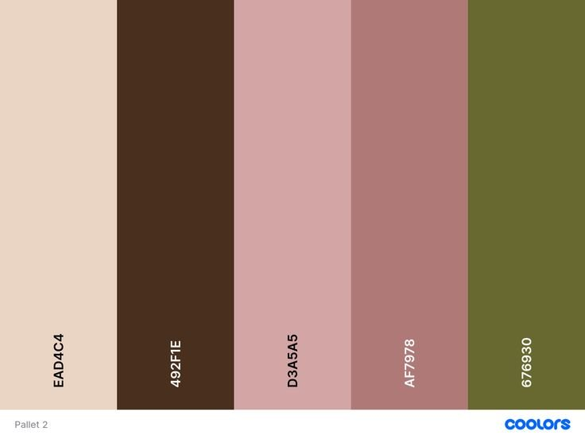
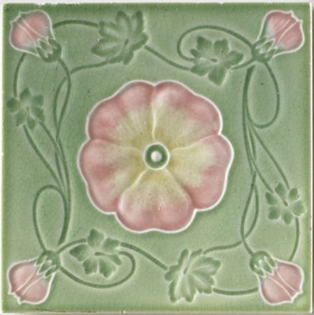
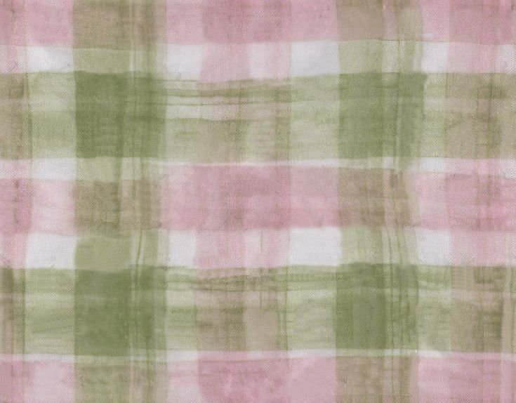
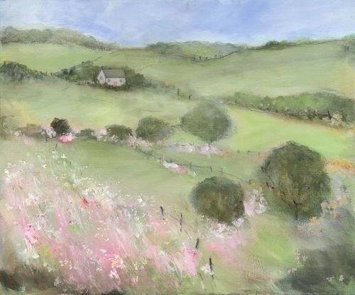

[README.md](https://github.com/user-attachments/files/26446511/README.md)
# 🌸 Bloom — A Study Planner Built with AI

Two versions of a study planner, both built through conversation with Claude. No code written. The difference between them is entirely the prompt.

---

## The Two Versions

| | `basic-prompt.html` | `bloom-prompt.html` |
|---|---|---|
| **Prompt** | One sentence | Paragraph + images |
| **Theme** | Generic dark UI | Spring, floral, intentional |
| **Features** | Basic | Grades, calendar, dark mode, search, shortcuts |

---

## The Prompts

### Version 1
```
make me a planning website for classes and assignments
```

### Version 2
```
code me a website that is a planner with classes and assignments

color scheme (photo 1): spring, floral, a good balance of dark and light 
colors so the website does not feel like impending dread

Themes of spring and growth like the growth mindset when studying, 
but not too obvious or cheesy
```

**With these reference images attached:**

| Color palette | Art nouveau tile | Plaid fabric | Pastoral painting |
|:---:|:---:|:---:|:---:|
|  |  |  |  |

The palette provided exact hex codes (`#EAD4C4`, `#492F1E`, `#D3A5A5`, `#AF7978`, `#676930`). The other three images communicated texture, mood, and color relationships that would have taken paragraphs to describe in words.

---

## Prompting Tips

### 1. Start simple, then react
A one-liner gets you something to react to. *"This feels too harsh"* or *"it looks like every other app"* is a valid follow-up prompt. You don't need a complete vision upfront.

### 2. Use images instead of descriptions
Upload color palettes, screenshots of sites you like, textures, paintings — anything that captures the feeling you want. Visuals communicate things words can't.

Good sources: [coolors.co](https://coolors.co) for palettes, Pinterest, screenshots of any site with the right vibe. (More references = more better!)

### 3. Describe the feeling, not just the feature

| Instead of this | Try this |
|---|---|
| "Use green and pink" | "Spring vibes — like wildflowers, not a hospital" |
| "Make it dark mode" | "Cozy late-night studying, not harsh" |
| "Add a progress bar" | "I want to feel like I'm growing, not just checking boxes" |

### 4. State your non-negotiables early
Context like *"I'm flowkey an anxious person so it needs to feel calm"* or *"I hate dashboards that look like spreadsheets"* immediately rules out a wide range of generic output.

### 5. Say what you don't want
Negative constraints are underrated. *"Not too cheesy"* and *"doesn't feel like impending dread"* both shaped this project meaningfully.

### 6. Ask what's missing
When stuck, ask: *"What would make this better?"* Then decide which suggestions to take. The feature expansion in this project (grades, calendar, dark mode, keyboard shortcuts) came from exactly that question.

### 7. Iterate in layers

```
1. One-liner          → get something functional
2. Visual references  → establish look and feel  
3. Specific features  → build on what's working
4. Polish             → "what would make this better?"
```

---

## File Structure

```
/
├── bloom-prompt.html   # Bloom — full-featured spring planner
├── basic-prompt.html   # Scholr — original one-liner version
├── palette.png     # Color palette reference
├── ref-tile.png    # Art nouveau tile reference
├── ref-plaid.png   # Plaid fabric reference
├── ref-painting.png # Pastoral painting reference
└── README.md
```

